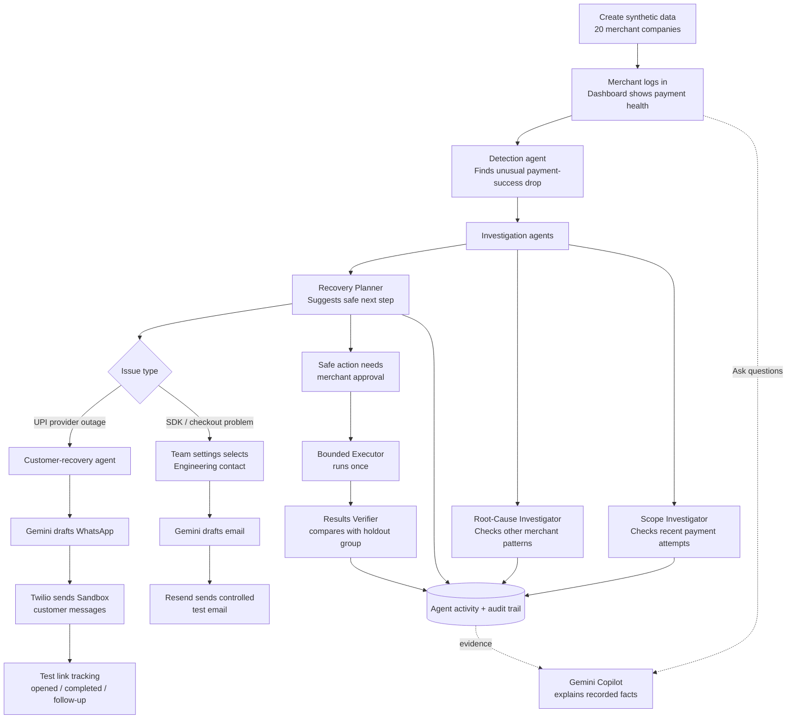

This is the hosted (Live Version = https://revenue-sre-agentic-copilot.streamlit.app/?embed=true&embed_options=show_padding&embed_options=hide_loading_screen

# Revenue SRE — Agentic Payment Reliability Copilot

> Detect payment degradation, investigate the evidence, recover safely, and measure the result.

Revenue SRE is a local, merchant-facing payment-reliability command center built for the Razorpay Buildathon. It turns a drop in payment success into an auditable workflow: identify the issue, determine its likely scope, route it to the right recovery path, require approval for customer-impacting actions, and measure whether recovery actually helped.

The app uses a reproducible synthetic portfolio of 20 merchants, so every part of the workflow can be demonstrated safely without changing a real checkout or collecting real money.

## The problem

Payment failures are difficult to operate because a success-rate drop can have very different causes:

- A **UPI provider outage** can affect an external payment network. Customers may need a safe fallback payment link.
- A **SDK or checkout regression** can be isolated to one merchant's implementation. It needs the engineering team, not a customer recovery campaign.
- A normal day-to-day variation should not create an unnecessary incident or alert.

The operational challenge is not only to detect the drop. It is to answer four questions safely:

1. Is this a real problem or normal variation?
2. Is it isolated to this merchant or shared across the payment network?
3. What is the smallest safe next action?
4. Did the approved action improve the outcome compared with doing nothing?

## Our solution

Revenue SRE combines deterministic specialist agents, stored evidence, explicit policy gates, and Gemini-powered communication.

- **Deterministic agents** investigate payment data and record their conclusions.
- **Gemini** explains evidence to the merchant and drafts human-readable emails and WhatsApp messages.
- **Policy gates** prevent Gemini or an agent from independently changing payments, issuing customer recovery links, or bypassing approval.
- **Twilio WhatsApp Sandbox** delivers controlled test customer messages and supports link/follow-up testing.
- **Resend** delivers controlled test emails for engineering escalation.
- **Results verification** compares the treated payment group with an unchanged holdout group.

## End-to-end workflow

This is the main workflow used by the project. GitHub renders the Mermaid diagram directly.



## Architecture

```text
Streamlit merchant dashboard
        │ HTTP + authenticated session
        ▼
FastAPI application ─────── SQLite audit store
        │                         │
        │                         ├─ synthetic payment events and findings
        │                         ├─ investigations, decisions, interventions
        │                         ├─ notifications and customer-recovery state
        │                         └─ agent activity and measurement evidence
        │
        ├─ Google Gemini: Copilot, email drafts, WhatsApp drafts
        ├─ Resend: controlled engineering test email
        ├─ Twilio WhatsApp Sandbox: controlled customer test messages
        └─ ngrok: public URL for Sandbox webhooks and test-payment links
```

## Agentic workflow and responsibilities

The dashboard does not use a free-running AI with permission to make payment changes. Instead, it uses persisted specialist steps with narrow responsibilities. Each step is recorded in the audit trail.

| Agent / layer | Main task | What it can do | What it cannot do |
|---|---|---|---|
| Detection Agent | Detect an abnormal success-rate drop | Create a payment finding from synthetic events | Change a payment setup |
| Scope Investigator | Decide whether the pattern is meaningful | Compare recent attempts with the merchant baseline | Contact customers or approve an action |
| Root-Cause Investigator | Check whether other merchants show the same pattern | Classify the issue as network-level or merchant-isolated | Claim a cause without recorded evidence |
| Recovery Planner | Select the smallest safe next step | Propose investigation, escalation, or recovery | Execute a payment change by itself |
| Bounded Executor | Run an already approved demo action once | Perform only the approved, scoped action | Repeat it or expand its scope |
| Results Verifier | Measure whether recovery helped | Compare treated versus unchanged holdout groups | Claim recovery without comparison evidence |
| Stakeholder Reply Monitor | Record signed WhatsApp replies | Store and explain a reply as evidence | Treat a WhatsApp reply as payment approval |
| Gemini Copilot | Explain recorded facts in natural language | Answer merchant questions; draft email/WhatsApp wording | Create facts, approve actions, or bypass policy |

### Important design principle

Gemini is the **language layer**, not the authority layer. The deterministic workflow, stored evidence, and approval checks control what happens next. This makes the demonstration agentic while keeping payment operations safe and explainable.

## Recovery paths

### 1. Software / SDK escalation

For a critical, merchant-isolated software issue such as an SDK regression or checkout JavaScript problem:

1. The investigators record the evidence and classify the problem.
2. Team Settings finds the appropriate engineering contact and severity threshold.
3. Gemini drafts a concise engineering email using the current facts.
4. The merchant reviews and confirms the send action.
5. Resend sends only to the configured controlled test inbox in this demo.

This path does **not** run for a pure UPI network outage, because a network issue is not automatically a merchant engineering defect.

### 2. UPI provider outage and customer recovery

For a confirmed network-level UPI provider issue:

1. The Customer-Recovery Agent prepares a small batch of Gemini-written WhatsApp drafts.
2. Each draft contains a unique synthetic test-payment link. No real money can be collected.
3. One merchant approval sends the small batch through Twilio WhatsApp Sandbox.
4. The dashboard tracks link opened, test payment completed, and one five-minute Gemini follow-up for unfinished cases.
5. The delivery view distinguishes **Twilio accepted** from final **delivered** status.

WhatsApp Sandbox messages still follow WhatsApp's conversation-window policy. A recipient outside the allowed window must message the Sandbox first or receive an approved WhatsApp template.

### 3. Approval, execution, and measurement

When the proposed recovery changes a customer-facing payment flow:

1. The merchant must explicitly approve it in the dashboard.
2. The Bounded Executor performs the already-approved demo action once.
3. The Results Verifier compares the changed group with an unchanged comparison group.
4. Revenue SRE reports the measured result, such as improved success rate and estimated additional successful payments.

## Team Settings

Team Settings is the routing directory for a merchant. It stores which team owns which type of alert, their contact details, and the minimum severity they accept.

For example, a critical SDK regression routes to Engineering. A payment network outage instead follows the UPI customer-recovery path. In this demo, the resolved route is visible for explanation, while real email delivery remains restricted to the configured Resend test inbox.

## Demo data and test scenarios

- **20 merchant accounts** are generated as a synthetic portfolio.
- A fresh generation clears previous demo decisions, alerts, and recovery batches while retaining demo account identities.
- Issue types and success-rate drops are randomized across scenarios.
- All payments, test links, customer actions, and outcome numbers are synthetic.

To see which merchant currently has each issue after generating data:

```powershell
$env:PYTHONPATH = "src"
.\.venv\Scripts\python.exe .\scripts\show_current_merchant_issues.py
```

Use one merchant with `UPI | upi_provider_degradation` for the WhatsApp path and one with `sdk_regression` for the engineering-email path.

## Local setup and run

### Prerequisites

- Python 3.12+
- A local virtual environment in `.venv`
- Google Gemini API access for Copilot and message drafting
- Twilio WhatsApp Sandbox for controlled customer-message testing
- Resend API access for controlled email testing
- ngrok when testing public links or inbound Twilio webhooks

### Environment configuration

Create a local `.env` file with the credentials and controlled test recipients required for your demo. Do not commit it.

Typical values include:

```text
GEMINI_API_KEY=...
RESEND_API_KEY=...
RESEND_FROM_EMAIL=...
RESEND_TEST_RECIPIENT=...
TWILIO_ACCOUNT_SID=...
TWILIO_AUTH_TOKEN=...
TWILIO_WHATSAPP_FROM=whatsapp:+...
TWILIO_CUSTOMER_TEST_RECIPIENTS=whatsapp:+...,whatsapp:+...
TWILIO_WEBHOOK_BASE_URL=https://your-ngrok-url
```

### Start the application

Open three PowerShell terminals in the project folder:

```powershell
# Terminal 1 — FastAPI backend
.\scripts\run_backend.ps1

# Terminal 2 — Streamlit dashboard
.\scripts\run_dashboard.ps1

# Terminal 3 — required for public test links and Twilio callbacks
.\scripts\run_ngrok.ps1
```

Open the dashboard at [http://127.0.0.1:8512](http://127.0.0.1:8512).

The backend runs locally at `http://127.0.0.1:8017`.

When ngrok gives a new public URL:

1. Update `TWILIO_WEBHOOK_BASE_URL` in `.env`.
2. Update the Twilio Sandbox inbound webhook URL to the new backend webhook URL.
3. Restart the FastAPI backend.

## Fast demo flow (3–4 minutes)

1. On the landing page, create a fresh synthetic run.
2. Use the issue-list command above to find a UPI provider outage merchant and an SDK regression merchant.
3. Sign in to the UPI merchant, run the investigation, prepare the Gemini customer-recovery drafts, approve the small Sandbox batch, and show link/delivery tracking.
4. Sign out and sign in to the SDK merchant, run the investigation, show the Engineering route, let Gemini prepare the email, and send it to the controlled Resend test inbox.
5. Show the Agent activity panel and the measured outcome to close the demo.

## Technology stack

| Layer | Technology |
|---|---|
| Dashboard | Streamlit |
| API | FastAPI + Uvicorn |
| Application language | Python |
| Data and audit trail | SQLite |
| Agent orchestration components | Persisted specialist workflow, LangGraph dependencies, deterministic policy checks |
| AI language layer | Google Gemini |
| Customer communication | Twilio WhatsApp Sandbox |
| Engineering-email demo | Resend |
| Public local tunnel | ngrok |

## Safety and demo boundaries

- No real payment is processed or collected.
- No real checkout configuration is changed.
- Customer recovery links are synthetic test pages with a **Payment done (test)** button.
- Customer-facing recovery and payment-flow actions require explicit merchant approval.
- Resend sends only to the configured test inbox in this demo.
- Twilio is limited to configured Sandbox-joined test recipients.
- Every investigation, decision, action, communication record, and measurement is stored for auditability.
- Never commit `.env`, API keys, authentication tokens, personal phone numbers, or real customer data.

---

Built as **Revenue SRE — Agentic Payment Reliability Copilot** for the Razorpay Buildathon.
